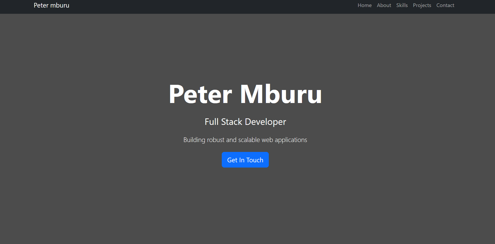

# Personal Portfolio Website

A modern and responsive portfolio website built for showcasing a full-stack developer's skills, projects, and professional experience. The website is built using HTML, CSS, and Bootstrap 5, making it easily customizable and maintainable.



## 🚀 Features

- Responsive design that works on all devices
- Clean and modern UI/UX
- Smooth scrolling navigation
- Interactive project cards with hover effects
- Skills section with category-based organization
- Contact form
- Social media integration
- Optimized for performance

## 📋 Sections

1. **Hero Section**: Full-screen welcome area with call-to-action
2. **About**: Personal introduction and professional summary
3. **Skills**: Technical skills organized by category
   - Frontend Development
   - Backend Development
   - Tools & Technologies
4. **Projects**: Showcase of featured work with project cards
5. **Contact**: Contact form for professional inquiries

## 🛠️ Technologies Used

- HTML5
- CSS3
- Bootstrap 5.3.2
- Font Awesome 6.4.2
- JavaScript (Bootstrap's JS bundle)

## 🔧 Installation & Setup

1. Clone the repository:
   ```bash
   git clone https://github.com/kiganyamburu/Emobilis-Web-Delelopment.git
   ```

2. Navigate to the project directory:
   ```bash
   cd Emobilis-Web-Delelopment
   ```

3. Open `index.html` in your preferred browser or set up a local server.

## 📝 Customization Guide

### Basic Customization

1. **Personal Information**
   - Update name, title, and about section in `index.html`
   - Replace profile picture in the about section
   - Update social media links

2. **Projects**
   - Replace project images
   - Update project titles and descriptions
   - Add links to live demos and repositories

3. **Skills**
   - Modify skill badges in each category
   - Add or remove skills as needed

### Advanced Customization

1. **Styling**
   - Custom styles are in the `<style>` section of `index.html`
   - Modify colors, fonts, and animations
   - Add new CSS classes as needed

2. **Layout**
   - Adjust Bootstrap grid classes for different layouts
   - Modify section spacing and padding
   - Add new sections as needed

### Images
- Replace placeholder images with your own:
  - Hero background: 1920x1080px recommended
  - Profile picture: 400x400px recommended
  - Project thumbnails: 400x300px recommended

## 📱 Responsive Design

The website is fully responsive and tested on:
- Mobile devices (320px and up)
- Tablets (768px and up)
- Desktops (992px and up)
- Large screens (1200px and up)

## 🔍 SEO

- Meta tags included for better SEO
- Semantic HTML structure
- Alt text for images
- Proper heading hierarchy

## ⚡ Performance Optimization

- CDN usage for faster loading of Bootstrap and Font Awesome
- Optimized images (when replacing placeholders)
- Minified CSS and JavaScript
- Efficient CSS selectors

## 📄 License

This project is open source and available under the [MIT License](LICENSE).

## 🤝 Contributing

Contributions, issues, and feature requests are welcome! Feel free to check [issues page](https://github.com/kiganyamburu/Emobilis-Web-Delelopment/tree/branch-2/Html%20css%20basic/Portfolio.)

## 📧 Contact

Your Name - [Peter Mburu](mburukiganya@email.com)

Project Link: [https://github.com/kiganyamburu/Emobilis-Web-Delelopment/tree/branch-2/Html%20css%20basic/Portfolio](https://github.com/kiganyamburu/Emobilis-Web-Delelopment/tree/branch-2/Html%20css%20basic/Portfolio)

## 🙏 Acknowledgments

- [Bootstrap](https://getbootstrap.com)
- [Font Awesome](https://fontawesome.com)
- [Google Fonts](https://fonts.google.com)

---
Made with ❤️ by Peter Mburu